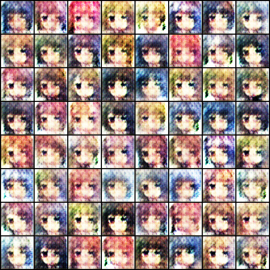
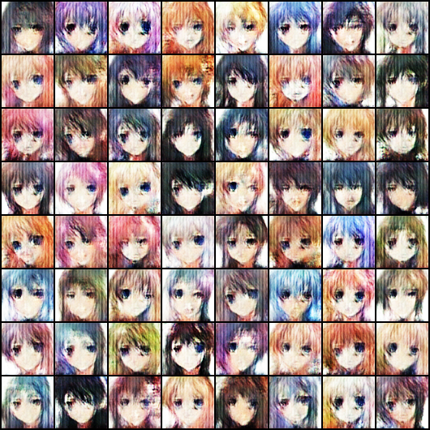
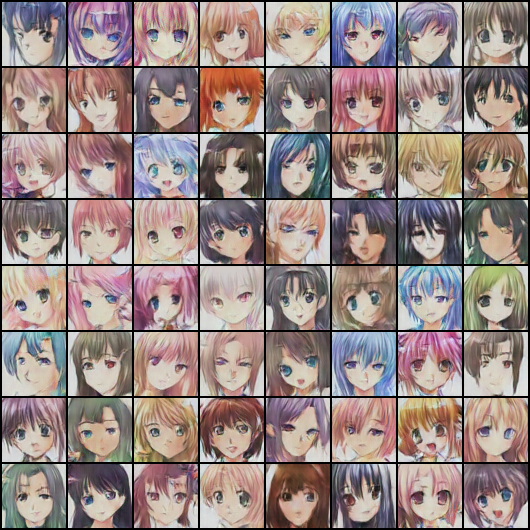
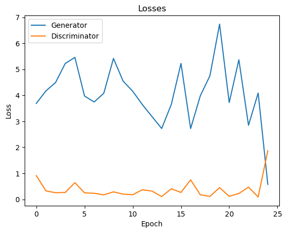

# Anime Face GAN

A DCGAN trained from scratch on a little over 63,000 anime faces. I built it to watch adversarial training up close: how fast a generator finds structure, how much later it finds variety, and whether the loss curves tell you anything about the pictures actually coming out.

Everything lives in one notebook, `animeFaceGAN.ipynb`, with all 25 epochs of output saved.

| Epoch 1 | Epoch 5 | Epoch 25 |
| --- | --- | --- |
|  |  |  |

Same 64 latent vectors in all three grids, held fixed across training so the columns are comparable.

## The setup

The generator takes a 128-dimensional latent vector through five `ConvTranspose2d` blocks to a 3×64×64 image. The discriminator mirrors it with strided convolutions down to a single sigmoid. Both train on binary cross-entropy with Adam at 2e-4, betas (0.5, 0.999), batch size 128, for 25 epochs on a Colab T4.

No gradient penalty, no label smoothing, no learning-rate schedule. The point was to see what the plain recipe does before reaching for anything else.

## What it showed

Structure comes almost immediately and variety comes late. After one epoch the generator already knows the template, eyes and hair and a face-shaped blob, but nearly every sample in the grid is the same face. By epoch 5 the faces are distinct from one another and the remaining twenty epochs are mostly spent cleaning up texture.



The losses are close to useless as a quality signal. Generator loss climbs from 3.69 to a spike of 6.74 at epoch 20 while the samples improve steadily the whole way. The one moment the curves do say something is the last epoch, where discriminator loss jumps to 1.87 and its mean score on real images drops from 0.94 to 0.22: after 24 stable epochs, it briefly loses the thread. The curves are jagged partly because they record the last batch of each epoch rather than an epoch average.

## Running it

The dataset is [splcher/animefacedataset](https://www.kaggle.com/datasets/splcher/animefacedataset) on Kaggle. The notebook expects it unpacked at `./animefacedataset/images`.

```bash
pip install -r requirements.txt
kaggle datasets download -d splcher/animefacedataset --unzip -p animefacedataset
jupyter notebook animeFaceGAN.ipynb
```

Training writes an 8×8 sample grid per epoch into `generated/` and saves `G.pth` and `D.pth` at the end. It will fall back to CPU without CUDA, which is not practical for 25 epochs at this batch size.
